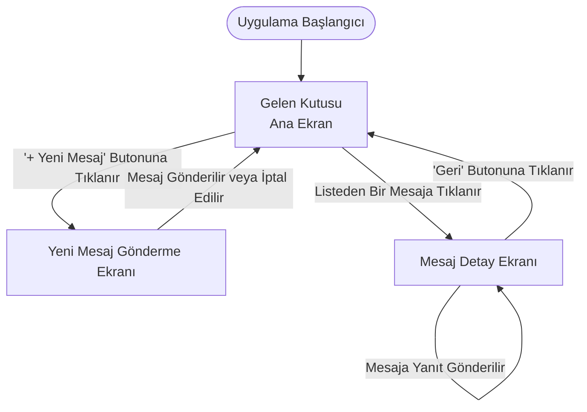

# LAB 4 - Wireframe ve Ekran Akışları

**Öğrenci Adı Soyadı:** Muhammed Eren Aydın  
**Öğrenci Numarası:** 230541034  
**Proje Adı:** Intra Mail Hub  

---

## 1. Uygulama Wireframe Tasarımları (Taslak Ekranlar)

Aşağıda uygulamanın temel işlevlerini yerine getiren 3 ana ekranın (Ana Liste, Veri Ekleme, Detay) düşük detaylı tel kafes (wireframe) çizimleri yer almaktadır.

### 1.1 Ekran 1: Gelen Kutusu (Liste / Ana Ekran)
Kullanıcının sisteme giriş yaptıktan sonra karşılaştığı, gelen mesajların listelendiği ana ekrandır.

```text
+-----------------------------------+
| [Menü ≡]   Intra Mail Hub  [Profil|
+-----------------------------------+
|                                   |
|      [ + YENİ MESAJ OLUŞTUR ]     |
|                                   |
+-----------------------------------+
| 📥 Gelen Mesajlar (2 Okunmamış)   |
+-----------------------------------+
| [👤 Ali Yılmaz] (Bölge Bayi)      |
| Konu: Aylık Rapor Hakkında        |
| Tarih: 12.05.2024      [Okunmadı] |
+-----------------------------------+
| [👤 Ayşe Demir] (Fabrika Yön.)    |
| Konu: Yeni Ürün Lansmanı          |
| Tarih: 11.05.2024                 |
+-----------------------------------+
| [👤 Mehmet Kaya] (Yerel Bayi)     |
| Konu: Stok Durumu                 |
| Tarih: 10.05.2024                 |
+-----------------------------------+
```

### 1.2 Ekran 2: Yeni Mesaj Ekranı (Veri Ekleme)
Kullanıcının sisteme yeni bir veri (mesaj) girdiği ve gönderdiği ekrandır. Gemini AI entegrasyonu butonu da burada bulunur.

```text
+-----------------------------------+
| [< Geri]       Yeni Mesaj         |
+-----------------------------------+
| Alıcı Seçimi (Hiyerarşiye Göre)   |
| [ Seçiniz ▼                     ] |
+-----------------------------------+
| Konu:                             |
| [_______________________________] |
+-----------------------------------+
| Mesajınız:                        |
| [                               ] |
| [                               ] |
| [                               ] |
+-----------------------------------+
| [ ✨ AI ile Metni Resmileştir ]   |
+-----------------------------------+
|                                   |
|          [ 🚀 GÖNDER ]            |
|                                   |
+-----------------------------------+
```

### 1.3 Ekran 3: Mesaj Detay ve Yanıtlama Ekranı (Detay Ekranı)
Kullanıcının listeden seçtiği bir mesajın detaylarını okuduğu ve yanıt yazabildiği ekrandır.

```text
+-----------------------------------+
| [< Geri]      Mesaj Detayı        |
+-----------------------------------+
| Kimden: Ali Yılmaz                |
| Konu: Aylık Rapor Hakkında        |
| Tarih: 12.05.2024 14:30           |
+-----------------------------------+
| Merhaba,                          |
|                                   |
| Geçen aya ait bölge satış         |
| raporlarını sisteme yükledim.     |
| İnceleyebilir misiniz?            |
| İyi çalışmalar.                   |
+-----------------------------------+
| [ ✨ AI ile Hızlı Yanıt Önerisi ] |
+-----------------------------------+
| Yanıtınız:                        |
| [_______________________] [Gönder]|
+-----------------------------------+
```

---

## 2. Ekranlar Arası Geçiş ve Kullanım Akışı

Kullanıcı senaryolarına dayanan ekran geçişleri aşağıdaki akış şemasında gösterilmiştir:

*   **Senaryo 1:** Kullanıcı uygulamayı açar, gelen mesajlarını listeler.
*   **Senaryo 2:** Kullanıcı yeni bir mesaj göndermek ister, Yeni Mesaj ekranına gider, mesajı yazar, AI ile düzenler ve gönderir, sonra ana ekrana döner.
*   **Senaryo 3:** Kullanıcı bir mesajın detayını okumak ister, listede mesaja tıklar. Gerekirse hızlı yanıt gönderir.


