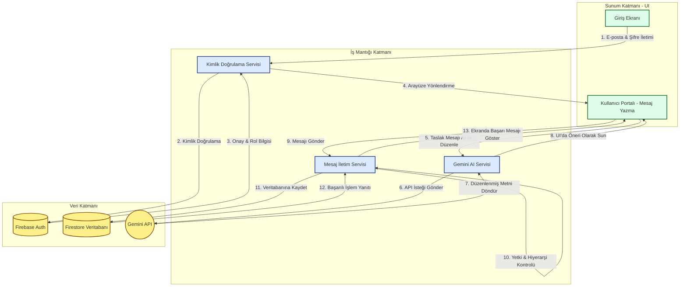

# LAB 6 - Mimari Tasarım ve Veri Akışı

**Öğrenci Adı Soyadı:** Muhammed Eren Aydın  
**Öğrenci Numarası:** 230541034  
**Proje Adı:** Intra Mail Hub  

---

## 1. Mimari Bileşenlerin Belirlenmesi

Intra Mail Hub uygulamasını oluşturan temel bileşenler şunlardır:

*   **Kullanıcı Arayüzü (UI / Ekranlar):** Kullanıcıların sistemle etkileşime girdiği arayüzlerdir. (Giriş Ekranı, Yönetim Paneli, Fabrika/Bölge/Yerel Bayi ve Çalışan Portalları).
*   **İş Mantığı (Uygulama Kuralları):** Hiyerarşik yetkilendirme kontrolleri, mesaj gönderme/alma kuralları, Gemini API üzerinden metin özetleme ve resmileştirme (formalize) işlemleri.
*   **Veri Kaynağı (Veritabanı / API):** Kullanıcı bilgileri ve mesaj içeriklerinin tutulduğu **Firebase (Firestore / Authentication)** ve yapay zeka işlemleri için dış servis olan **Gemini API**.

## 2. Katmanlı Yapı

Uygulamanın mimarisi üç ana katmandan oluşmaktadır:

1.  **Sunum Katmanı (UI Katmanı):**
    *   Kullanıcı giriş ekranı (`giris.html`)
    *   Rol bazlı portallar (`fabrika.html`, `bolge.html`, `yerel.html`, `calisan.html`, `yonetim.html`)
2.  **İş Mantığı Katmanı:**
    *   Oturum yönetimi ve Kimlik doğrulama işlemleri
    *   Hiyerarşik iletişim kısıtlamaları (Örn: Alt bayinin sadece üst bölge bayisine mesaj atabilmesi)
    *   Gemini AI Entegrasyon Servisleri (Mesajı resmileştirme, özet çıkarma, akıllı yanıt oluşturma)
3.  **Veri Katmanı:**
    *   Firebase Authentication (Kullanıcı giriş/çıkış yönetimi)
    *   Firebase Cloud Firestore (Mesaj içerikleri, kullanıcı rolleri, admin log kayıtları)
    *   Gemini API (Yapay zeka veri alışverişi)

## 3. Veri Akışı ve Mimari Diyagram

Aşağıdaki şemada, bir kullanıcının sisteme giriş yapıp yapay zeka destekli bir mesaj göndermesi sırasındaki veri akışı aşamalar halinde gösterilmiştir.

